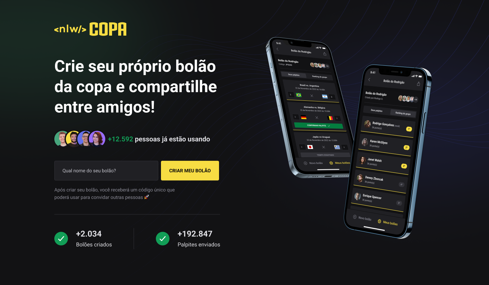

<h1 align="center"> NLW Copa Bolão Web </h1>

Aplicação desenvolvida em evento promovido pela Rocketseat para ensino de tecnologias WEB e Mobile.

🔗 <a href="">Clique aqui para acessar a página do projeto</a>

🔗 <a href="">Clique aqui para acessar o projeto no github</a>

  <a href="#-tecnologias">Tecnologias</a>&nbsp;&nbsp;&nbsp;|&nbsp;&nbsp;&nbsp;
  <a href="#-projeto">Projeto</a>&nbsp;&nbsp;&nbsp;|&nbsp;&nbsp;&nbsp;
  <a href="#-layout">Layout</a>&nbsp;&nbsp;&nbsp;|&nbsp;&nbsp;&nbsp;
  <a href="#memo-licença">Licença</a>

  

 

  

## 🚀 Tecnologias

Esse projeto foi desenvolvido com as seguintes tecnologias:

- [Next](https://nextjs.org/)
- [TypeScript](https://www.typescriptlang.org/)
- [Tailwindscss](https://tailwindcss.com/)
- [React](https://reactjs.org/)

## 💻 Projeto

O NLW Copa Bolão Web é a versão Web de uma aplicação desenvolvida para o envio de palpites nos jogos da copa entre amigos e familiares, usando o Next como base do projeto, React com TypeScript para fundamentação da página e Tailwind para a estilação da página. Sendo a página capaz de criar bolões de acordo com o nome inserido pelo usuário.

## 🔖 Layout

Você pode visualizar o layout do projeto através [DESSE LINK](https://www.figma.com/file/In6fYhWH7PHHin4pe39T4F/Bol%C3%A3o-da-Copa?node-id=0%3A1&t=iyliObn1e1y9KUMz-1). É necessário ter conta no [Figma](https://figma.com) para acessá-lo.

## :memo: Licença

Esse projeto está sob a licença MIT.

---

Feito com ♥ by John :wave: [Participe da comunidade Rocketseat!](https://discord.gg/rocketseat)
